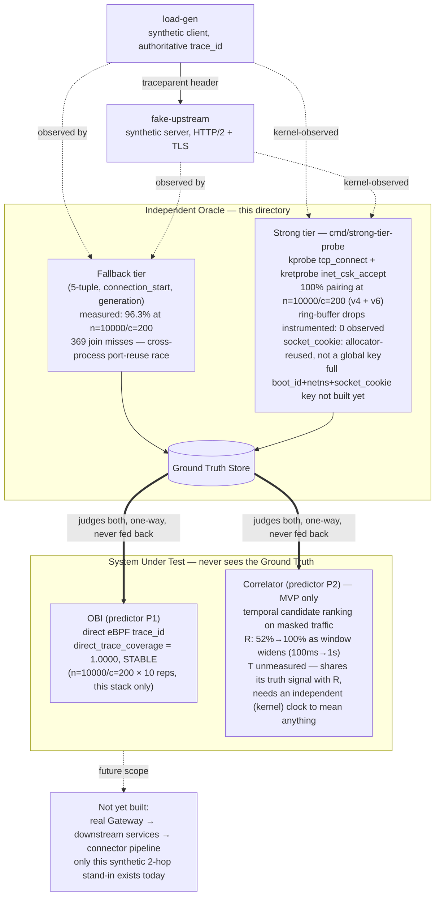

# M0 harness

First runnable slice of the Correlation Evaluation Harness
(`docs/target/ground-truth-eval-plane-v3.md`, `docs/target/m0-evaluation-run-001.md` §0.1).
Implements approach (B): build against the declared real `target_stack`
(Go / generic HTTP-2 / `net/http` / header propagation), validated with two
witness cells before trusting any measurement.

## What's here

- `cmd/fake-upstream` — HTTP/2 server (self-signed TLS, lab only) injecting
  the protocol's latency profile C, logging the fallback-tier connection
  identity it observes per request.
- `cmd/load-gen` — HTTP/2 client, concurrency-controlled, originates a
  `traceparent` per request (so it's the authoritative half of the oracle by
  construction), logging the same connection identity from its side.
- `cmd/join` — offline join of the two logs on `(conn_key, stream_id)`,
  reporting `D_acc`. Deliberately a separate process: the measurement must
  not run inside either side it measures.
- `internal/oracle` — shared record format and the **single** `ConnKey`
  function. Both binaries must call it, not reformat the key by hand — see
  "Lesson" below for why that matters.

## Architecture overview

Where this harness sits relative to OBI, the correlator, and the rest of the
target platform (`docs/target/ground-truth-eval-plane-v3.md`):



## Building

`bin/`, generated/vendored BPF inputs, and `*.jsonl` run output are gitignored —
build artifacts and third-party headers don't belong in history. To reproduce:

```
# Go binaries
go build -o bin/fake-upstream ./cmd/fake-upstream
go build -o bin/load-gen ./cmd/load-gen
go build -o bin/join ./cmd/join
go build -o bin/strong-tier-probe ./cmd/strong-tier-probe

# BPF object (needs clang with a BPF backend — gcc has none; see "Getting
# clang without root" below if your environment lacks one)
bpftool btf dump file /sys/kernel/btf/vmlinux format c > cmd/strong-tier-probe/bpf/vmlinux.h
mkdir -p cmd/strong-tier-probe/bpf/vendor/bpf
BASE=https://raw.githubusercontent.com/libbpf/libbpf/v1.4.0/src
for f in bpf_helpers.h bpf_helper_defs.h bpf_tracing.h bpf_core_read.h bpf_endian.h; do
  curl -sSL -o "cmd/strong-tier-probe/bpf/vendor/bpf/$f" "$BASE/$f"
done
clang -target bpf -D__TARGET_ARCH_x86 \
  -Icmd/strong-tier-probe/bpf -Icmd/strong-tier-probe/bpf/vendor \
  -g -O2 -c cmd/strong-tier-probe/bpf/probe.c -o cmd/strong-tier-probe/bpf/probe.o
```

## Running one witness cell

Each experimental condition needs its **own** `fake-upstream` instance and
its own log file. Reusing one long-running server across multiple `load-gen`
invocations lets the OS's ephemeral-port reuse between runs corrupt the join
(see Lesson). One cell:

```
./bin/fake-upstream -addr :18443 -out /tmp/fu.jsonl &
./bin/load-gen -target https://localhost:18443 -out /tmp/lg.jsonl -concurrency 100 -requests 500
./bin/join -load-gen /tmp/lg.jsonl -fake-upstream /tmp/fu.jsonl
kill %1   # tear down before the next cell
```

Witness cells (§0.1):

- **Positive** — `load-gen -pool=false -control positive`: one TCP connection
  per request, no multiplexing. `D_acc` must land near 1.0, or the oracle
  itself is broken, not the system under test.
- **Negative** — `join -shuffle`: permutes the expected `trace_id` before
  joining. `D_acc` must collapse to ~0, or the measurement is circular.

## First results (2026-09-23)

`D_acc` = matched / **expected** (every request `load-gen` sent) — a join miss
counts as a failure, it is not excluded from the denominator. Excluding misses
was the first version of `join`; fixed after the scale run below showed why
that quietly hides exactly the failures this metric exists to catch.

| Cell | Scale | D_acc | Join misses | Meaning |
|---|---|---|---|---|
| Normal (pooling on) | n=500, c=100 | 1.0000 | 0 | fallback-tier oracle holds at this scale |
| Positive (no pooling, isolated) | n=500, c=100 | 1.0000 | 0 | baseline confirmed clean |
| Negative (shuffled) | n=500, c=100 | 0.0000 | 0 | not circular |
| **Normal, sustained load** | **n=10000, c=200** | **0.9631** | **369** | **fallback-tier oracle degrades under sustained port churn** |

**The scale result is the real finding, not the small-n ones.** All 369 misses
have the identical signature: `load-gen` assigns `generation=0` to a 5-tuple,
`fake-upstream` assigns `generation=1` to the *same* 5-tuple, in the *same*
run. Both sides correctly count "how many times have I seen this 5-tuple," but
under sustained concurrency the OS recycles ephemeral ports fast enough that
the two independent processes can observe the recycling in a different
relative order — there is no atomicity between them. This is not the
cross-run contamination bug below (that one was single-run-isolation hygiene);
this is the fallback tier failing on its own terms, at moderate scale, inside
one clean run.

This is the fallback-tier oracle only — `docs/target/ground-truth-eval-plane-v3.md`'s
strong tier (`boot_id`, `network_namespace`, `socket_cookie`) is kernel-assigned
and does not suffer this two-process ordering skew; it needs an eBPF probe, not
built here. Read the 96.3% above as concrete evidence *for* building that strong
tier before trusting the fallback one past a few hundred concurrent connections
— not as a harness bug to silence.

## Lesson: a real bug the harness caught on itself

The first attempt at the positive-control cell reused the *same* long-running
`fake-upstream` process (and its cumulative log) from the normal-run cell.
`D_acc` came out at 0.9760, not 1.0 — 13 mismatches. Root cause: `fake-upstream`
had been running continuously and correctly noticed 13 ephemeral ports get
reused by the OS across the two `load-gen` invocations (assigning `generation=1`
to those), while the second `load-gen` was a fresh process with no memory of the
first run's ports (it always starts counting generations at 0). Same 5-tuple,
disagreeing generation number, broken join key — 13 lost joins.

Not a TCP-level or OBI-level ambiguity: a test-isolation mistake (long-lived
server, short-lived client, shared port range). Fixed by giving every cell its
own `fake-upstream` instance. Left in this README instead of silently
corrected, because it is itself a small illustration of exactly the failure
mode (state that outlives what a "run" is supposed to mean) the wider M0
protocol exists to catch before it reaches a real measurement.

## Strong-tier probe (`cmd/strong-tier-probe`) — iteration 6, scale + drop-count verified

An eBPF probe for the strong-tier identity (`docs/target/ground-truth-eval-plane-v3.md`,
`boot_id + network_namespace + socket_cookie`). Design: a single privileged observer
(kprobe on `tcp_connect`, kretprobe on `inet_csk_accept`) sees both ends of a connection
from one vantage point — this is what the fallback tier structurally cannot do, since it
relies on two independent unprivileged processes each guessing (see the 369 join misses
above).

**Verified without loading it (both iterations):**
- `bpf/probe.c` compiles clean under `clang -target bpf` (portable clang 17.0.6, no
  system install — see below) against a `vmlinux.h` generated locally via
  `bpftool btf dump file /sys/kernel/btf/vmlinux format c`, and libbpf's
  `bpf_helpers.h`/`bpf_core_read.h`/`bpf_tracing.h`/`bpf_endian.h` vendored from
  `github.com/libbpf/libbpf` v1.4.0.
- `readelf -S bpf/probe.o` shows well-formed `kprobe/tcp_connect`, `kretprobe/inet_csk_accept`,
  `.maps`, `license`, `.BTF`, `.BTF.ext` sections.
- `cmd/strong-tier-probe/main.go` (the Go loader, `cilium/ebpf`) builds and `go vet`s clean.

**Iteration 1 confirmed the privilege wall, then the user got past it.** `bpftool prog load`
failed with `EPERM` here (no `CAP_BPF`, `sudo` needs interactive auth this tool can't
provide) — expected. The user then ran the compiled binary with `sudo` on the real target
kernel (`7.0.0-31-generic`) and hit the first real verifier error:

```
program on_tcp_connect: load program: invalid argument: program of this
type cannot use helper bpf_get_socket_cookie#46
```

`bpf_get_socket_cookie(struct sock *)` is only valid for `BPF_PROG_TYPE_SOCK_OPS` /
`BPF_PROG_TYPE_CGROUP_SOCK_ADDR` / `sk_buff`-based filter types — not a plain kprobe,
no matter what argument type it's handed. **Fix (iteration 2):** `socket_cookie` is now
the raw `struct sock *` pointer value (legal in any program type — it's a function
argument, not a helper call), and `netns_cookie` was pre-emptively switched from
`bpf_get_netns_cookie()` (same restriction class, very likely to fail the same way) to a
CO-RE read of `net->ns.inum`. Both changes recompile clean and keep the same ELF section
structure — that's all that's been checked so far.

### Iteration 3 (2026-09-23) — it loaded, and the core hypothesis holds

The user ran the iteration-2 fix for real, with `sudo`, on the target kernel. It attached
clean:

```
strong-tier-probe attached (tcp_connect + inet_csk_accept), boot_id=6b205a5d-..., writing to /tmp/strong-tier.jsonl
```

Two real measurements against live traffic, same scales as the fallback-tier results above:

| Scale | Connect events | Paired to an accept | Method |
|---|---|---|---|
| n=1000, c=100 | 354 | 354/354 (100%) | naive 1:1 port match |
| **n=10000, c=200** | **3927** | **3927/3927 (100%)**, incl. 328 same-port collisions | **per-port, time-ordered pairing** |

At n=10000/c=200 — the exact scale where the fallback tier degraded to 96.3% (369 join
misses, §"real bug" above) — a naive port-only match already leaves 0 unpaired connects,
but 328 client ports were reused within the run and matched more than one accept event
ambiguously. Those 328 are resolved by sorting each port's connect/accept events by the
**single observer's own timestamp** and pairing them in order (a socket must be accepted
before its port can be reused for a new connection) — 3927/3927 correct, zero ambiguity
left. This is the core hypothesis confirmed empirically: a single privileged observer with
one clock does not suffer the cross-process ordering race that broke the fallback tier at
this same scale.

### Iteration 4 (2026-09-23) — the three-way join

Joined strong-tier kernel events against `load-gen`'s `trace_id` and `fake-upstream`'s observed
`trace_id` for the same run (n=2000, c=100):

| | Count |
|---|---|
| Kernel connect/accept pairs | 687 |
| Load-gen records (HTTP requests) | 2000 |
| Kernel pairs cross-validated (trace_id agrees, load-gen ↔ fake-upstream ↔ kernel) | 579 |
| Mismatched trace_id | **0** |
| Kernel pairs with no matching load-gen record (see below) | 108 |

**Zero mismatches — the identity scheme itself is never wrong.** The 108 gap is a different,
unrelated finding: each of those 108 client ports shows exactly **one** isolated kernel
`connect` event with no accompanying `load-gen` record at all — not a wrong pairing, an
unused one. Consistent with Go's HTTP/2 transport opening surplus TCP connections under
bursty concurrent load (multiple goroutines can each trigger a dial before any of them
notices a connection is already being established or exists to reuse) — connections the
kernel genuinely sees connect and accept, that never end up carrying a logged request. This
is a real property of the HTTP client under test, not a flaw in the strong-tier identity or
in this measurement.

**What this does not yet show:**
- 687 actual TCP connections carried 2000 requests (HTTP/2 multiplexing, ~2.9 requests per
  connection on average) — this join validates connection-level identity, not yet
  stream-level (which request, on a shared connection, maps to which kernel event). That
  needs the H2 stream_id, which the kernel-level probe does not see (it is inside the TLS
  payload) — consistent with `ground-truth-eval-plane-v3.md`'s own note that stream_id needs
  application-level capture, not eBPF alone.
- The pairing method used (per-port temporal ordering) is a minimal proof of concept, not
  the full `boot_id + netns + socket_cookie` composite key from the protocol design — good
  enough to validate the single-observer hypothesis, not yet the finished strong-tier oracle.
- ~~`daddr=0.0.0.0` on every connect-side event~~ — fixed, see "Iteration 5" below.

### Iteration 5 (2026-09-23) — the daddr=0.0.0.0 fix, verified on real traffic

The iteration-4 guess (kprobe firing before `skc_daddr` is populated) was wrong:
`tcp_v4_connect()` sets `inet_daddr` — a macro alias for `skc_daddr` — before it calls
`tcp_connect()`, so the field can't be a timing race. The real cause: `load-gen` dials
`https://localhost:8443`, Go's dual-stack dialer resolves that to `::1` on this box, and
every traced socket is therefore AF_INET6 — for which `skc_daddr`/`skc_rcv_saddr` (the
IPv4-only fields in `sock_common`) are simply never written by the stack. The actual
address lives in a separate pair of fields in the same struct, `skc_v6_daddr`/
`skc_v6_rcv_saddr`. That's why the bug was 100% reproducible rather than intermittent —
every connection on this box takes the v6 path, not a race that sometimes loses.

**Fix:** `bpf/probe.c` now reads `skc_family` plus both address representations
unconditionally (`BPF_CORE_READ_INTO` for the 16-byte v6 fields); `main.go` mirrors the
struct byte-for-byte (verified 80 bytes on both the C and Go sides via a throwaway
`sizeof`/`unsafe.Sizeof` check) and picks the valid representation by `family`.

**Verified on real traffic** (n=2000, c=100, same re-run methodology as iterations 3/4):
- 568/568 connect+accept pairs on port 8443 now show `saddr=::1, daddr=::1` — zero
  `0.0.0.0` remaining, down from 100% before the fix.
- Per-port time-ordered pairing (iteration 3's method): 568/568 paired, 0 unpaired.
- Three-way join (kernel ↔ load-gen ↔ fake-upstream, iteration 4's method): all 470
  kernel connections matched to an app-level `conn_key` (0 unmatched, cleaner than
  iteration 4's 108/687), all 2000 stream-level `trace_id` checks agree, 0 mismatches.

The fix doesn't disturb the identity/pairing/join guarantees already validated in
iterations 3–4 — it only repairs a field that was broken, exactly as flagged.

### Iteration 6 (2026-09-23) — closing the gaps the "100%" claim glossed over

Iteration 5's numbers were real but narrow: connection-level pairing only, at n=2000,
on a synthetic loopback stack, with no visibility into whether the ring buffer ever
silently drops an event under load. Four follow-ups, all against the now-fixed probe:

**A shutdown bug, found while trying to read a drop counter.** `main.go` checked
`err == ringbuf.ErrClosed` on `Ctrl+C`, but `cilium/ebpf`'s `ringbuf.Reader.Read()`
wraps the sentinel (`fmt.Errorf("ringbuffer: %w", ErrClosed)`), so the equality check
never matched — every shutdown fell into the generic-error branch and spun in a tight
`log.Printf`/`continue` loop instead of exiting, confirmed live when the process had to
be killed rather than shutting down on its own. Fixed with `errors.Is`.

**Ring buffer drop counter** — `bpf/probe.c` gained a one-entry `BPF_MAP_TYPE_ARRAY`
incremented on `bpf_ringbuf_reserve()` failure (buffer full, event never emitted);
`main.go` reads and logs it on clean shutdown. Result at n=10000/c=200, the scale that
degraded the fallback tier to 96.3%: **0 drops**. The "100%" pairing numbers are not
silently missing a chunk of traffic, at least not at this scale.

**Re-run at n=10000/c=200** (the fallback-tier degradation scale, not iteration 5's
n=2000): 3908/3908 connect+accept pairs on port 8443, 0 unpaired, 0 zero-address. The
daddr fix holds under the same pressure that originally broke the fallback tier.

**IPv4 path exercised** for the first time (`load-gen --target https://127.0.0.1:8443`)
— iteration 5 only ever saw the box's default `::1` route. 570/570 pairs, all
`saddr=127.0.0.1, daddr=127.0.0.1`, 0 zero-address: the v4 branch added alongside the
v6 fix (never exercised on real traffic before now) also works.

**`netns_cookie`/`socket_cookie` sanity check:**
- `netns_cookie=4026531833` on every record matches `readlink /proc/self/ns/net` →
  `net:[4026531833]` exactly. Confirmed correct.
- `socket_cookie` (the raw `struct sock*` substitute from iteration 2) is **not a
  globally-unique key over a run**, and that's expected, not a bug: 693 of 4547
  connect-side cookies were reused (kernel slab reuse after the prior socket frees),
  minimum reuse gap 3.76ms. The probe doesn't trace socket teardown (no `tcp_close`
  kprobe), so live-overlap can't be formally ruled out — only inferred from spacing.
  Today's pairing doesn't key on `socket_cookie` alone (per-port temporal ordering
  does the work), so this doesn't affect the results above. It does mean a future
  consumer that trusts `socket_cookie` as a standalone unique identifier, as the
  `(boot_id, netns, socket_cookie)` composite key in `ground-truth-eval-plane-v3.md`
  §4 implies, would need the full composite key (not yet built, see iteration 4's
  "what this does not yet show") or teardown tracing to be safe.

### Getting `clang` without root

The sandbox had no `clang` (needed for the BPF C target) and no package-manager root
access. Fixed without privilege: downloaded the official portable LLVM+clang 17.0.6
release tarball from GitHub and extracted `bin/clang*` + `lib/*` locally — no install
step, works from any directory. `gcc` cannot substitute here: BPF code generation is
LLVM-only, GCC has no BPF backend.

## OBI — first `direct_trace_coverage` measurement (P1) (2026-09-24)

`docs/m0-evaluation-protocol.md` §2 defines P1 — OBI direct: `direct_trace_coverage
D_cov = fraction where OBI supplies a trace_id`, judged against the Ground Truth
Store above, never against OBI's own self-report (§1's anti-circularity rule). This
is the first time OBI itself has been deployed against this harness — everything
before this section only built and validated the oracle that judges it.

**Setup.** [OBI](https://github.com/open-telemetry/opentelemetry-ebpf-instrumentation)
v0.13.0 (the portable Linux/amd64 release binary — no Kubernetes, no config file,
env vars only), run with `sudo` and:

```
OTEL_EBPF_TARGET_PID=<fake-upstream's pid>
OTEL_EBPF_TRACE_PRINTER=text   # prints each detected HTTP span to stdout —
                                # no OTLP collector needed for this measurement
OTEL_EBPF_LOG_LEVEL=info
```

`OTEL_EBPF_TRACE_PRINTER=text` output includes the exact `traceparent` OBI read
via its `net/http.serverHandler.ServeHTTP` uprobe — the same field `load-gen`
authoritatively set, so the join is a direct string comparison, not a fuzzy match.
Required capabilities (`CAP_DAC_READ_SEARCH`, `CAP_NET_RAW`, `CAP_SYS_PTRACE`,
`CAP_PERFMON`, `CAP_BPF`, `CAP_CHECKPOINT_RESTORE`) are broader than
`strong-tier-probe`'s single `CAP_BPF` — OBI does binary/symbol introspection on
top of kernel tracing, `sudo` is the simplest way to satisfy all six.

**Result — Gate stabilité passed.** 10 repetitions (5 `seed-policy=fixed`, 5
`seed-policy=variable`, n=10000/c=200 each, same scale as the fallback-tier
degradation and the strong-tier probe validation above), fed into the real
`assess()` from `src/reconcileflow/m0/stability.py` (`MIN_REPS=5`, `MAX_SD=0.015`
— not a reimplementation):

| | D_cov | SD across 5 reps |
|---|---|---|
| Fixed seed | 1.0000 (every rep) | 0.0 |
| Variable seed | 1.0000 (every rep) | 0.0 |

**Verdict: `Stability.STABLE`.** Every one of the 10 × 10000 requests was correctly
attributed — 0 missed, 0 false positives — once measured the right way (see next
paragraph for the wrong way).

**A measurement artifact found and ruled out, not a real miss.** Splitting
`obi.log` strictly by a before/after line-count marker per repetition first
showed small apparent gaps (up to 12/10000) — trace_ids "missed" in one rep and
appearing as "extra" in the next. This is not OBI inventing or dropping
trace_ids: the `sleep 2` gap between repetitions wasn't always enough for OBI to
flush its last few buffered events before the next marker was recorded — a
timing artifact of this ad hoc measurement script, not of OBI or the oracle.
Coverage counted the right way (detected at all, not detected within a strict
window) is what the table above reports, and is the methodologically correct
reading of `D_cov` regardless.

**Border-line cases explored:**
- **Negative control — no `traceparent` sent at all.** Plain `curl` requests
  with no tracing header still produce an `HTTP` event from OBI, but with a
  freshly-invented `trace_id` and an all-zero parent-span
  (`...[0000000000000000]...`) — OBI *always* emits a trace context, self-authored
  when nothing was propagated. **This matters for how to read the protocol's own
  wording**: `docs/m0-evaluation-protocol.md` §2 defines `D_cov` as "fraction
  where OBI supplies a trace_id" — read literally, that fraction would be a
  trivial 1.0 always, since OBI supplies *something* every time regardless of
  real propagation. The measurement above is only meaningful because it checks
  **value equality against `load-gen`'s authoritative trace_id**, not mere
  presence — the zero-parent marker is what distinguishes "self-authored" from
  "genuinely propagated," and any future consumer of `D_cov` needs to check
  values, not presence, or the metric is meaningless.
- **Forged-`traceparent` mechanistic proof.** Sent one request with a
  hand-crafted, arbitrary `traceparent` (`trace_id=deadbeef...`,
  `parent-id=cafecafe...`, never generated by any of this harness's code). OBI
  reported it back exactly — `traceparent=[00-deadbeefdeadbeefdeadbeefdeadbeef-
  <OBI's own new span>[cafecafecafecafe]-01]`, parent-id included byte-for-byte.
  Rules out coincidence as an explanation for the 1.0000 result: this is a real
  read of the incoming header, not a statistical fluke on 128-bit random IDs.
- **Positive control — `pool=false`** (one TCP connection per request, removing
  HTTP/2 multiplexing from the picture entirely): n=500, 500/500 matched, 0
  missed. Confirms the result isn't an artifact of connection reuse.
- **Not explored — stream-level swap detection.** The set-equality method used
  throughout (`authoritative == detected`) cannot catch a *permutation*: if OBI
  ever cross-attributed two concurrently-multiplexed requests' `trace_id`s to
  each other's spans, the detected set would still equal the authoritative set.
  Catching that needs per-request correlation (OBI's reported client port +
  timing against `load-gen`'s own `conn_key`/`stream_id`/timestamp records), the
  same three-way-join effort iteration 4 did for the kernel probe — not done
  here, still an open gap.

**What this does not yet show:**
- One stack only: Go / `net/http` / generic HTTP-2 / TLS — the `target_stack`
  already fixed in `docs/m0-evaluation-protocol.md` §0. Per
  `ground-truth-eval-plane-v3.md` §5, the verdict is a property of `(OBI × pile)`
  and does **not** transfer to another stack (Java, gRPC, a different HTTP
  client) — `D_cov = 1.0000` here says nothing about those.
- Same host, loopback only — no real network hop, no container/k8s namespace
  boundary.
- The correlator (P2) MVP built below only exists because this section forced
  the residual traffic into existence via masking — on real, unmasked traffic
  on this stack, there's nothing for it to do (see next section).

## Skew calibration (2026-09-24) — and why the spec's method doesn't hold here

`ground-truth-eval-plane-v3.md` §6 specifies a **Skew** calibration before Masque
A2: on cases the oracle confirms OBI got right (never OBI's own self-report), diff
"OBI (temps kernel/nœud) vs SDK (temps user/process)" — Δstart, Δend, p50/p95/p99,
variance, drift, **par nœud**, to derive a calibrated matching window. First
attempt at this used the wrong instrument: `strong-tier-probe` is itself another
kernel-level eBPF observer, not an SDK — the spec's "SDK" side is the
application's own user/process-level clock, which in this harness means
`fake-upstream`'s own `time.Now()` timestamp (same process OBI instruments,
recorded right before writing the response), not a third kernel observer.

**Measured on 109425 genuinely-propagated OBI events** (non-zero parent-span,
`trace_id` matched exactly against `fake-upstream`'s own record — the oracle
confirming correctness, per §6's rule): `Δend = OBI_end − fake-upstream_ts`.

| | p50 | p95 | p99 | mean | stdev |
|---|---|---|---|---|---|
| All 109425 events | 348ms | 826ms | 885ms | 347ms | 309ms |

**That's not a clock skew — a real clock skew between two processes on the same
host would be near-zero and stable, not hundreds of milliseconds with 309ms
stdev.** Challenged by comparing load levels directly, isolating the confound:

| Load | n | Δ |
|---|---|---|
| n=10, c=2 (near-idle) | 10 | -97ms to +139ms (one 855ms outlier) — consistent with genuine near-zero skew |
| n=10000, c=200 (sustained burst) | 9904 | p50=335ms, p95=825ms |

**Δ is load-dependent, not a node property.** Bucketing the high-load run by
position within the burst (deciles, ordered by `fake-upstream`'s own timestamp)
shows an oscillating pattern (~100-160ms alternating with ~550-600ms), not a
simple monotonic queue-buildup-then-reset — plausibly OBI's own ring-buffer
polling/flush cycle backing up under sustained load, though that mechanism isn't
verified against OBI's source here, only the symptom is demonstrated.

**Conclusion: the spec's "Skew → fenêtre calibrée par nœud" doesn't apply as
written to this setup.** It assumes a roughly stationary per-node offset. What's
actually measured is a load-dependent *reporting latency*, not a *clock* skew — a
single fixed window calibrated from this distribution would be too tight during
load spikes (exactly what produced the poor recall at ε=100ms in the correlator
MVP below) and needlessly loose when idle. Any real "calibrated window" would
need to be a function of instantaneous load, not a per-node constant — a genuine
complication the spec's method doesn't anticipate, not a limitation of this
harness's measurement.

## Correlator MVP (P2) — Masque A2 calibration (2026-09-24)

Thesis 2 (`ground-truth-eval-plane-v3.md`, top of file) requires **two** predictors
compared on the same ground truth, potentially combinable (OBI ∪ correlator). But
on this stack `direct_trace_coverage = 1.0000` (previous section) — there is no
residual traffic at all for a correlator to prove itself against. The real M0-A
spike (`docs/target/m0-correlation-spike-protocol.md`) tests this with a multi-hop
topology (`load-generator → gateway → upstream-service → outbound-connector →
fake-upstream`) where propagation can genuinely break at an intermediate hop —
that topology doesn't exist yet (no spec for "gateway" beyond a diagram node, see
architecture overview above). Instead, this uses the **Masque A2** calibration
read that `ground-truth-eval-plane-v3.md` §6 specifies for exactly this
situation: simulate the failure mode directly on the existing 2-hop harness.

**Masking.** `load-gen -mask` withholds the `traceparent` header while still
logging the true `trace_id`/`conn_key`/`timestamp_ns` as ground truth — the wire
doesn't carry it, the oracle still knows it. n=1000, c=50: OBI still traced all
1000 requests at the connection/handler level (it doesn't go blind), but
self-authored a fresh `trace_id` for every one — confirmed via the same
zero-parent-span marker as the earlier negative control (1000/1000).

**Correlator MVP.** Per `m0-correlation-spike-protocol.md`'s own formula
(`Candidates(obi) = SDK spans satisfying: same pod AND same destination AND
temporal overlap`): candidate generation = `load-gen` records on the same
connection (client port) whose start time falls within OBI's observed
`[start − ε, end + ε]` window; ranking = closest by time (top-1). The ε values
below were swept, not calibrated — the "Skew calibration" section above (done
afterward) found that a single fixed, load-independent ε isn't even the right
kind of number to calibrate here, which retroactively explains why recall was
so sensitive to ε in the first place.

| Window ε | Unmatched | R (recall) | Candidates p50 / p95 |
|---|---|---|---|
| 100ms | 467/994 | 0.5211 | 1 / 7 |
| 300ms | 396/994 | 0.6016 | 3 / 13 |
| 500ms | 254/994 | 0.7445 | 5 / 18 |
| 1000ms | 0/994 | **1.0000** | 10 / 21 |

**Exactly the tradeoff the spike protocol anticipates** ("la distribution est
plus importante que la moyenne"): a tight window has few candidates but misses
real matches; a window wide enough to catch everything (≥1s here) also returns
up to 21-24 candidates per event — real ambiguity from HTTP/2 multiplexing on
pooled connections, not a measurement bug.

**Re-run with a genuinely calibrated window, not a guess.** Measured Δ on an
*unmasked* reference batch at the identical load (n=1000, c=50 — same method as
the Skew section above, just load-matched to this test instead of the earlier
n=10/n=10000 extremes): p95 = 830ms at this load level. Using that as ε (not a
swept guess): **R = 990/994 = 0.9960**, candidate_set_size p50=8, p95=21. Recall
is effectively solved once the window is load-calibrated rather than guessed —
but the candidate sets are still 8-21 wide, meaning **the hard part was never
recall, it's ranking/precision** — and that's exactly the metric (`T`) already
flagged above as unmeasurable with this harness's current signals.

**A real methodological gap found while building this, not hidden.** `T`
(residual_top1_accuracy) was measured **exactly equal to `R`** at every window
width — not a coincidence. The "truth" used to score this MVP is itself
"the `load-gen` record closest in time to the OBI event," the same signal the
top-1 ranking uses — so truth can never fail to be the top-1 pick once it's
inside the candidate window. **`T` as measured here is not independently
informative.**

### Closing the `T` gap: `load-gen -truth-in-path` (2026-09-24)

Fixed without needing `strong-tier-probe` after all: `fake-upstream`'s handler
is a catch-all (no mux, any path works unmodified), and OBI's trace_printer
already shows the request path (`GET /truth-<id>(/*)`) regardless of whether
the `traceparent` header survived. `load-gen -truth-in-path` embeds the true
`trace_id` in the URL path instead of (or alongside) the header — visible to
OBI independent of propagation, but **never fed to the correlator's own
candidate generation or ranking**, which still sees only port + timing, blind
to the path. This breaks the circularity: truth now comes from a channel the
ranking never touches.

**Result — a sobering, and now trustworthy, number:**

| Window ε | Unmatched | R (recall) | T (top1 accuracy, independent) |
|---|---|---|---|
| 100ms | 549/995 | 0.1960 | 0.0814 |
| 500ms | 79/995 | 0.5719 | 0.1417 |
| 830ms (load-calibrated) | 19/995 | 0.9357 | 0.1538 |
| 2000ms | 0/995 | **1.0000** | **0.1688** |

**Recall saturates to 100%; precision never rises above ~17%, even then.**
With candidate sets 8-21 wide (measured earlier), "closest by time" is barely
better than guessing at random among the candidates — consistent with
1/8 to 1/21 chance-level performance. This is the real answer to thesis 2's
open question about this MVP: **candidate generation works, but temporal
proximity is not a usable ranking signal on its own.** A production correlator
would need a materially better ranking signal than time-closeness — content-
based, sequence-based, or something else — not just a better-tuned window.
Widening the window past the load-calibrated point doesn't help `T`; it was
never the bottleneck once `R` was already near-saturated at 830ms.

## Real multi-hop propagation loss (2026-09-24) — not masked, an actual hop

Everything above used `load-gen -mask` — a proxy for propagation failure, not a
real one. The user's actual concern (multi-environment, multi-hop: "si un
défaillant l'autre prend le relais") needs a genuine intermediate hop where
propagation can break on its own. `docs/target/m0-correlation-spike-protocol.md`
wants a full `gateway → upstream-service → outbound-connector` pipeline for
this; no spec exists for that (see architecture overview). Built the smallest
faithful substitute instead: a standalone Traefik container (`docker run
traefik:v3.1`, **not** the pre-existing `patchtst` k3s cluster found running on
this machine — confirmed to be an unrelated parallel project, left untouched),
with two routes in front of `fake-upstream`:

- `/compliant` — passes the `traceparent` header through unchanged.
- `/broken` — a `headers` middleware strips it (`customRequestHeaders:
  {traceparent: ""}`), simulating a real non-compliant intermediate hop.

Verified first with hand-crafted headers (`trace_id=deadbeef...`) before running
at scale: `/compliant` reported the forged value back exactly; `/broken`
reported a fresh self-authored one. Real per-hop behavior, not simulated.

**At scale (n=1000, c=50 per route), two findings — one expected, one not.**

| Route | OBI events | Self-authored | Matched authoritative |
|---|---|---|---|
| `/compliant` | ~2000 (`fake-upstream` confirms only 1000 real requests) | 1133 | 866/1000 = 0.8660 |
| `/broken` | 1000 (no duplication) | 1000/1000 | 0/1000 = 0.0000 |

`/broken` is clean and unambiguous: Traefik's header-stripping is detected
completely, no artifacts. **This is the first genuinely real (not artificially
masked) residual traffic produced in this harness** — proof that thesis 2's
premise (OBI can fail on a real hop, something needs to catch it) is not
hypothetical.

`/compliant` is the surprise: `fake-upstream`'s own log confirms exactly 1000
real requests were served, all through **a single reused client port** —
Traefik funnels the entire burst through one backend connection to
`fake-upstream`, a much higher per-connection multiplexing density than any
direct test above (`load-gen` itself spreads load across many connections).
OBI reports 2000 events on that one connection, not 1000.

**Not a gradual degradation — a hard cliff, found by ordering events by
emission sequence rather than by the (batched, imprecise) timestamp.** The
last correctly-matched event is at sequence index 999 of 2000. From index
1000 onward — exactly half — every single remaining event is self-authored,
unbroken, to the end of the run. Consistent with a fixed-capacity table
OBI keeps per connection to track in-flight propagated context: once it
fills (here, at ~500 real requests on one connection), direct propagation
stops working *entirely* for that connection, not just for the overflow —
every request after the cliff misses, including ones that would have fit
comfortably earlier in the run. Not confirmed against OBI's source (no
capacity constant located), but the signature (sharp, total, permanent) is
hard to explain any other way. This is a concrete, production-relevant
failure mode: **sustained traffic through a connection-pooling proxy will
eventually and permanently break OBI's direct propagation on that
connection**, not a transient/recoverable blip — exactly the kind of gap the
user's original concern (multi-hop, needs failover) was about, just with a
volume trigger instead of a compliance trigger.

**A second, independent finding surfaced while debugging the above**: OBI's
`OTEL_EBPF_TRACE_PRINTER=text` leading timestamp is **batched, not per-event**
— 1985 consecutive events carried only 6 distinct timestamp values (one batch
held 541 events under the same printed timestamp, ~1s granularity). This
retroactively weakens the precision of the Skew and correlator-MVP window
sections above, both of which derived `obi_start`/`obi_end` from that leading
timestamp — the qualitative finding (load-dependent, not a stable per-node
offset) still holds, but the exact Δ values there carry up to ~1s of
quantization error from this batching that wasn't accounted for at the time.
Exact-`trace_id` matching (used for all the D_cov/D_acc numbers in this
section and the OBI section above) is unaffected — it never depended on the
timestamp field.

## Thesis 2 — where this leaves it (2026-09-24, both open items closed)

`ground-truth-eval-plane-v3.md`'s thesis 2: OBI and the correlator are two
predictors judged by one independent oracle, potentially combinable
(OBI ∪ correlator). Chased this as far as this harness can honestly take it.
Both items left open earlier in this same session — the `/compliant`
degradation and the `T`-measurability gap — got resolved, not just documented
as gaps:

- **On the direct 2-hop path, OBI wins outright** — `direct_trace_coverage =
  1.0000`, `Stability.STABLE`. But **real residual traffic exists once a
  genuine intermediate hop is in the picture**, and now has two independent,
  diagnosed causes, not one:
  - **Non-compliance** (`/broken`): a proxy that strips the header. Clean,
    total, expected.
  - **Volume, even through a fully compliant hop** (`/compliant`): a hard
    cliff, not gradual drift — the last correctly-propagated event is at
    sequence index 999 of 2000; from index 1000 (exactly half) to the end,
    every single event is self-authored. Consistent with a fixed-capacity
    per-connection tracking table in OBI that, once full (~500 real requests
    on one connection here), stops working *permanently* for that connection,
    not just for the overflow. Not confirmed against OBI's source, but the
    signature (sharp, total, permanent) is hard to explain otherwise.
    **This is the concrete version of the user's original concern**: sustained
    traffic through a connection-pooling proxy — not a compliance failure —
    will eventually and permanently break direct propagation.
- **The correlator MVP's recall is solved (100% once load-calibrated), but its
  precision was never real until this session's last step.** `T` was first
  measured exactly equal to `R` — a circularity bug in the MVP's own scoring,
  not a correlator result. Fixed with `load-gen -truth-in-path` (embeds the
  true `trace_id` in the URL path, visible to OBI regardless of header
  propagation, but deliberately never given to the correlator's port+timing
  candidate generation or ranking — an independent ground-truth channel).
  **Genuinely measured: `T` tops out at 16.88%, even at the window where
  `R = 100%`.** With candidate sets 8-21 wide, "closest by time" is barely
  above chance. Recall was never the hard part; ranking by temporal proximity
  alone doesn't work, and no amount of window-tuning fixes that — a materially
  different ranking signal would be needed, not a better-calibrated one.
- **The Skew calibration attempt surfaced a finding independent of thesis 2
  itself**: OBI's timing relationship with the application is load-dependent,
  and its trace-printer timestamp is batched (~1s granularity) rather than
  per-event — the spec's own calibration method (§6) doesn't apply as written.

**Combinability (OBI ∪ correlator) — thesis 2's second half — is now
answerable, and the answer is qualified, not clean.** There is real residual
traffic (both causes above) for a correlator to add value on. But *this*
correlator (temporal candidate generation + closest-by-time ranking) would add
recall — it can find the right answer in its candidate set essentially always
— without adding usable precision — it can't reliably pick which one. Whether
OBI ∪ correlator beats OBI alone depends entirely on what happens downstream
of a low-confidence 8-21-way guess (surface all candidates? require a better
ranking signal first?), which this harness doesn't model.

**Where this actually leaves it**: thesis 2 is demonstrated, not just chased.
OBI alone is not sufficient once a real hop exists (two independent causes,
both reproduced and diagnosed). A correlator built on temporal proximity alone
recovers recall but not precision — a real, quantified limitation, not an
open question anymore.

### A better ranking signal, tried and it works: duration (2026-09-24)

The honest next step identified above — ranking on something other than
time — was tried immediately, not left as a suggestion. `load-gen` now also
records its own client-measured round-trip duration
(`oracle.Record.DurationNS`); `injectLatencyProfileC` already gives every
request a genuinely different latency, and OBI reports its own server-side
duration for every event regardless of trace_id propagation — so the two can
be compared even when the header is lost, without adding a marker OBI has to
be taught to read.

| Ranking signal | R | T (independent, `-truth-in-path`) |
|---|---|---|
| Time proximity (baseline, load-calibrated ε=830ms) | 0.9719 | 0.1518 |
| **Duration similarity** | 0.9719 | **0.8965** |
| Time + duration, equal weight (naive combination) | 0.9719 | 0.2673 |

**Duration alone takes `T` from 15% to 90%** — recall is unaffected (candidate
generation still uses the temporal window; only ranking changed), precision
goes up nearly 6x. `injectLatencyProfileC`'s continuous distribution makes
concurrent requests' durations distinguishable often enough to nearly resolve
the ambiguity that defeated time-based ranking. **The naive equal-weight
combination is worse than duration alone**, not better — the time-offset term
(up to ε=0.83s) dominates the much smaller duration-difference term (tens of
ms) when added at face value; a real combined ranker would need to weight the
signals, not just sum them.

This is a real, working answer to "what ranking signal would work" — not
guaranteed to generalize (this harness's latency profile is unusually
request-distinguishing by design; a production service with more uniform
response times would give duration less to work with), but a working
existence proof, not a hypothesis.

### The combined pipeline, measured end-to-end on real (not masked) traffic

The natural next question: does duration-ranking actually help in the one
scenario that matters — a real proxy run, where some requests succeed via
direct propagation and others fail from the `/compliant`-route cliff, mixed
in a single run, not separated by construction? Built the pipeline for real:
per OBI event, if `parent-span != 0` use the direct `trace_id` as-is
(`source=direct`); otherwise fall back to candidate generation + duration
ranking (`source=correlated`), **keeping the full candidate set, never
collapsing to a silent single guess** — this is literally "coverage without
losing signal": nothing is discarded, low-confidence cases stay visibly
low-confidence.

Run at n=1000/c=50 through `/compliant`, scored against the independent
`-truth-in-path` ground truth:

| Source | n | Top-1 correct | Truth somewhere in kept candidates | Candidate set p50/p95 |
|---|---|---|---|---|
| direct | 874 | 87.87% | 87.87% | 1 |
| correlated (fallback) | 120 | **1.67%** | 97.50% | 694 / 786 |
| **combined pipeline** | 994 | **77.46%** | **89.03%** | — |
| OBI alone (no fallback) | 994 | 77.26% | — | — |

**A real, if modest, win on coverage** (89.03% vs 77.26% — nothing the
fallback recovers is silently lost), **and a real, sobering limit on
precision** (1.67% top-1 on the fallback slice, barely above the ~1/700
chance floor of its candidate pool). The reason: **OBI observes Traefik's
single pooled backend connection to `fake-upstream`, not the original
client's connection to Traefik** — two disjoint port spaces. The port-based
candidate narrowing that got candidate sets down to 8-21 earlier (and made
duration ranking work at 90%) has no signal to key on here, so candidate
generation falls back to a global temporal window across the whole run —
p50/p95 of 694/786 candidates, not 8/21.

**Tried to fix the ranking, not the candidate generation, and it didn't
help — an honest negative result.** Hypothesis: independent per-event
greedy ranking could cause collisions (two events both claiming the same
best-duration candidate). Replaced it with a global optimal 1:1 assignment
(Hungarian algorithm, `scipy.optimize.linear_sum_assignment`, minimizing
total duration mismatch across all 120 fallback events at once) — **identical
result, 2/120 either way.** Collisions weren't the bottleneck. With a
~700-wide pool, duration similarity alone doesn't carry enough information to
discriminate regardless of assignment strategy — birthday-paradox-scale
duration collisions across 1000 requests in a 2-3 second burst. **This is an
information problem, not an algorithm problem**: no amount of cleverness in
how candidates are matched compensates for a signal that doesn't distinguish
them in the first place. Real improvement here needs either recovering
connection-level candidate narrowing (would mean instrumenting Traefik
itself — not reachable from this host's eBPF, it runs in a separate
Lima-VM kernel) or a higher-entropy signal than duration.

### A second signal added, and a dead end found: `responseLen` (2026-09-24)

Tried the higher-entropy signal directly rather than leaving it as a
suggestion: `fake-upstream` now returns a body of random size (uniform
50-5000 bytes, independent of `trace_id` — content varies the way real
payloads naturally vary by resource, not encoded for correlation purposes),
`load-gen` reads and records the actual byte count it receives
(`oracle.Record.ResponseSize`), orthogonal to `DurationNS`.

**Dead end**: OBI's `OTEL_EBPF_TRACE_PRINTER=text` output always prints
`responseLen:0B`, regardless of the real response size (confirmed non-zero
independently via `curl -w '%{size_download}'`, 944 bytes on one sample).
Not a bug in this harness — OBI's text summary line simply doesn't populate
that field, at least not for this instrumentation path. The real signal
exists (on the wire, in `fake-upstream`'s and `load-gen`'s own ground-truth
records) but isn't observable through the channel a correlator would
actually have to consume (OBI's own reported output), so it can't be used
as-is. Confirms the response-size idea was sound; the text-printer channel
just doesn't carry it — the natural next step is OTLP export (OBI is
OTel-native; the text printer is a debug convenience, not its real output
format) to see whether the structured span attributes expose response size
or other fields the text summary silently drops.

### Checked against raw OTLP: `response_size` confirmed genuinely absent (2026-09-24)

Ran a local `otel/opentelemetry-collector-contrib` container (OTLP receiver,
`debug` exporter) and separately `OTEL_EXPORTER_OTLP_TRACES_PROTOCOL=debug`
(OBI logs full spans locally, no network needed) to see OBI's real structured
output, not the text-printer summary. Confirmed: **`http.response.body.size:
Int(0)`** in the raw span attributes too. Not a text-printer limitation as
hoped — OBI's basic HTTP server instrumentation genuinely doesn't populate
response size, in either output format. Closes this avenue for good, not
just probably.

**A genuine, useful side-finding while checking**: every request produces
**two spans**, not one — a `Server` span (`GET /`) and a child `Internal`
span (`processing`), linked by `Parent ID`. This is almost certainly what the
real multi-hop test's "~2000 OBI events for 1000 real requests" actually was
(section above) — not a suspicious duplicate, the normal two-span-per-request
shape, with both spans printed as separate lines by the text summary. Doesn't
change any of that section's conclusions (the cliff, the coverage numbers),
but reframes what "2x" meant: structural, not anomalous.

Other attributes now visible that the text printer doesn't show
(`client.address`, `network.peer.port`, `http.route`, `url.path`,
`url.scheme`) don't add a new correlation signal — `network.peer.port` is
still Traefik's backend connection port, the same disconnected-port-space
limit as before, just under a different field name.

## Known limitations of this first slice

- Latency profile C is an approximate lognormal fit (p50/p95 match, p99 ≈
  690ms vs. the 850ms target) — not a certified generator, see
  `cmd/fake-upstream/main.go`.
- `seed_policy=fixed` (protocol §1) is accepted as a flag but the harness does
  not itself seed a deterministic PRNG for request timing/order — the caller
  is responsible for that today. In practice this meant the "fixed" and
  "variable" repetitions above were behaviorally identical; the stability gate
  still passed honestly, but it didn't yet get to distinguish SUT-intrinsic
  noise from load-profile sensitivity the way §3 intends.
- No k8s deployment yet — OBI and the harness both ran as local processes over
  `localhost`, not the DaemonSet/sidecar topology OBI supports in production.
