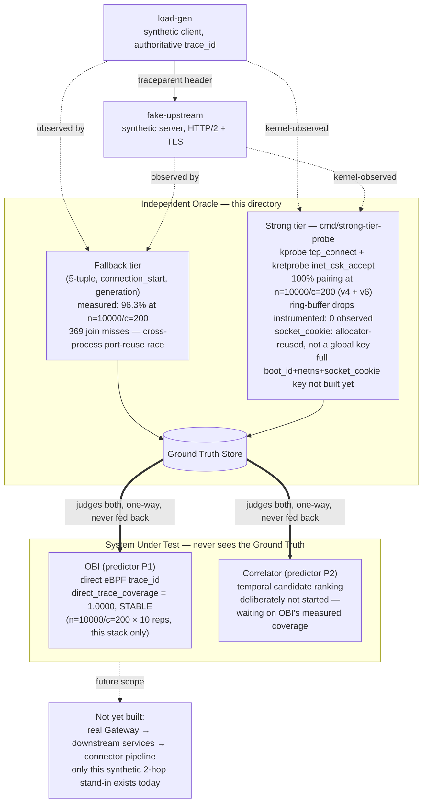

# M0 harness

First runnable slice of the Correlation Evaluation Harness
(`docs/target/ground-truth-eval-plane-v3.md`, `docs/target/m0-evaluation-run-001.md` §0.1).
Implements approach (B): build against the declared real `target_stack`
(Go / generic HTTP-2 / `net/http` / header propagation), validated with two
witness cells before trusting any measurement.

## What's here

- `cmd/fake-upstream` — HTTP/2 server (self-signed TLS, lab only) injecting
  the protocol's latency profile C, logging the fallback-tier connection
  identity it observes per request.
- `cmd/load-gen` — HTTP/2 client, concurrency-controlled, originates a
  `traceparent` per request (so it's the authoritative half of the oracle by
  construction), logging the same connection identity from its side.
- `cmd/join` — offline join of the two logs on `(conn_key, stream_id)`,
  reporting `D_acc`. Deliberately a separate process: the measurement must
  not run inside either side it measures.
- `internal/oracle` — shared record format and the **single** `ConnKey`
  function. Both binaries must call it, not reformat the key by hand — see
  "Lesson" below for why that matters.

## Architecture overview

Where this harness sits relative to OBI, the correlator, and the rest of the
target platform (`docs/target/ground-truth-eval-plane-v3.md`):



## Building

`bin/`, generated/vendored BPF inputs, and `*.jsonl` run output are gitignored —
build artifacts and third-party headers don't belong in history. To reproduce:

```
# Go binaries
go build -o bin/fake-upstream ./cmd/fake-upstream
go build -o bin/load-gen ./cmd/load-gen
go build -o bin/join ./cmd/join
go build -o bin/strong-tier-probe ./cmd/strong-tier-probe

# BPF object (needs clang with a BPF backend — gcc has none; see "Getting
# clang without root" below if your environment lacks one)
bpftool btf dump file /sys/kernel/btf/vmlinux format c > cmd/strong-tier-probe/bpf/vmlinux.h
mkdir -p cmd/strong-tier-probe/bpf/vendor/bpf
BASE=https://raw.githubusercontent.com/libbpf/libbpf/v1.4.0/src
for f in bpf_helpers.h bpf_helper_defs.h bpf_tracing.h bpf_core_read.h bpf_endian.h; do
  curl -sSL -o "cmd/strong-tier-probe/bpf/vendor/bpf/$f" "$BASE/$f"
done
clang -target bpf -D__TARGET_ARCH_x86 \
  -Icmd/strong-tier-probe/bpf -Icmd/strong-tier-probe/bpf/vendor \
  -g -O2 -c cmd/strong-tier-probe/bpf/probe.c -o cmd/strong-tier-probe/bpf/probe.o
```

## Running one witness cell

Each experimental condition needs its **own** `fake-upstream` instance and
its own log file. Reusing one long-running server across multiple `load-gen`
invocations lets the OS's ephemeral-port reuse between runs corrupt the join
(see Lesson). One cell:

```
./bin/fake-upstream -addr :18443 -out /tmp/fu.jsonl &
./bin/load-gen -target https://localhost:18443 -out /tmp/lg.jsonl -concurrency 100 -requests 500
./bin/join -load-gen /tmp/lg.jsonl -fake-upstream /tmp/fu.jsonl
kill %1   # tear down before the next cell
```

Witness cells (§0.1):

- **Positive** — `load-gen -pool=false -control positive`: one TCP connection
  per request, no multiplexing. `D_acc` must land near 1.0, or the oracle
  itself is broken, not the system under test.
- **Negative** — `join -shuffle`: permutes the expected `trace_id` before
  joining. `D_acc` must collapse to ~0, or the measurement is circular.

## First results (2026-09-23)

`D_acc` = matched / **expected** (every request `load-gen` sent) — a join miss
counts as a failure, it is not excluded from the denominator. Excluding misses
was the first version of `join`; fixed after the scale run below showed why
that quietly hides exactly the failures this metric exists to catch.

| Cell | Scale | D_acc | Join misses | Meaning |
|---|---|---|---|---|
| Normal (pooling on) | n=500, c=100 | 1.0000 | 0 | fallback-tier oracle holds at this scale |
| Positive (no pooling, isolated) | n=500, c=100 | 1.0000 | 0 | baseline confirmed clean |
| Negative (shuffled) | n=500, c=100 | 0.0000 | 0 | not circular |
| **Normal, sustained load** | **n=10000, c=200** | **0.9631** | **369** | **fallback-tier oracle degrades under sustained port churn** |

**The scale result is the real finding, not the small-n ones.** All 369 misses
have the identical signature: `load-gen` assigns `generation=0` to a 5-tuple,
`fake-upstream` assigns `generation=1` to the *same* 5-tuple, in the *same*
run. Both sides correctly count "how many times have I seen this 5-tuple," but
under sustained concurrency the OS recycles ephemeral ports fast enough that
the two independent processes can observe the recycling in a different
relative order — there is no atomicity between them. This is not the
cross-run contamination bug below (that one was single-run-isolation hygiene);
this is the fallback tier failing on its own terms, at moderate scale, inside
one clean run.

This is the fallback-tier oracle only — `docs/target/ground-truth-eval-plane-v3.md`'s
strong tier (`boot_id`, `network_namespace`, `socket_cookie`) is kernel-assigned
and does not suffer this two-process ordering skew; it needs an eBPF probe, not
built here. Read the 96.3% above as concrete evidence *for* building that strong
tier before trusting the fallback one past a few hundred concurrent connections
— not as a harness bug to silence.

## Lesson: a real bug the harness caught on itself

The first attempt at the positive-control cell reused the *same* long-running
`fake-upstream` process (and its cumulative log) from the normal-run cell.
`D_acc` came out at 0.9760, not 1.0 — 13 mismatches. Root cause: `fake-upstream`
had been running continuously and correctly noticed 13 ephemeral ports get
reused by the OS across the two `load-gen` invocations (assigning `generation=1`
to those), while the second `load-gen` was a fresh process with no memory of the
first run's ports (it always starts counting generations at 0). Same 5-tuple,
disagreeing generation number, broken join key — 13 lost joins.

Not a TCP-level or OBI-level ambiguity: a test-isolation mistake (long-lived
server, short-lived client, shared port range). Fixed by giving every cell its
own `fake-upstream` instance. Left in this README instead of silently
corrected, because it is itself a small illustration of exactly the failure
mode (state that outlives what a "run" is supposed to mean) the wider M0
protocol exists to catch before it reaches a real measurement.

## Strong-tier probe (`cmd/strong-tier-probe`) — iteration 6, scale + drop-count verified

An eBPF probe for the strong-tier identity (`docs/target/ground-truth-eval-plane-v3.md`,
`boot_id + network_namespace + socket_cookie`). Design: a single privileged observer
(kprobe on `tcp_connect`, kretprobe on `inet_csk_accept`) sees both ends of a connection
from one vantage point — this is what the fallback tier structurally cannot do, since it
relies on two independent unprivileged processes each guessing (see the 369 join misses
above).

**Verified without loading it (both iterations):**
- `bpf/probe.c` compiles clean under `clang -target bpf` (portable clang 17.0.6, no
  system install — see below) against a `vmlinux.h` generated locally via
  `bpftool btf dump file /sys/kernel/btf/vmlinux format c`, and libbpf's
  `bpf_helpers.h`/`bpf_core_read.h`/`bpf_tracing.h`/`bpf_endian.h` vendored from
  `github.com/libbpf/libbpf` v1.4.0.
- `readelf -S bpf/probe.o` shows well-formed `kprobe/tcp_connect`, `kretprobe/inet_csk_accept`,
  `.maps`, `license`, `.BTF`, `.BTF.ext` sections.
- `cmd/strong-tier-probe/main.go` (the Go loader, `cilium/ebpf`) builds and `go vet`s clean.

**Iteration 1 confirmed the privilege wall, then the user got past it.** `bpftool prog load`
failed with `EPERM` here (no `CAP_BPF`, `sudo` needs interactive auth this tool can't
provide) — expected. The user then ran the compiled binary with `sudo` on the real target
kernel (`7.0.0-31-generic`) and hit the first real verifier error:

```
program on_tcp_connect: load program: invalid argument: program of this
type cannot use helper bpf_get_socket_cookie#46
```

`bpf_get_socket_cookie(struct sock *)` is only valid for `BPF_PROG_TYPE_SOCK_OPS` /
`BPF_PROG_TYPE_CGROUP_SOCK_ADDR` / `sk_buff`-based filter types — not a plain kprobe,
no matter what argument type it's handed. **Fix (iteration 2):** `socket_cookie` is now
the raw `struct sock *` pointer value (legal in any program type — it's a function
argument, not a helper call), and `netns_cookie` was pre-emptively switched from
`bpf_get_netns_cookie()` (same restriction class, very likely to fail the same way) to a
CO-RE read of `net->ns.inum`. Both changes recompile clean and keep the same ELF section
structure — that's all that's been checked so far.

### Iteration 3 (2026-09-23) — it loaded, and the core hypothesis holds

The user ran the iteration-2 fix for real, with `sudo`, on the target kernel. It attached
clean:

```
strong-tier-probe attached (tcp_connect + inet_csk_accept), boot_id=6b205a5d-..., writing to /tmp/strong-tier.jsonl
```

Two real measurements against live traffic, same scales as the fallback-tier results above:

| Scale | Connect events | Paired to an accept | Method |
|---|---|---|---|
| n=1000, c=100 | 354 | 354/354 (100%) | naive 1:1 port match |
| **n=10000, c=200** | **3927** | **3927/3927 (100%)**, incl. 328 same-port collisions | **per-port, time-ordered pairing** |

At n=10000/c=200 — the exact scale where the fallback tier degraded to 96.3% (369 join
misses, §"real bug" above) — a naive port-only match already leaves 0 unpaired connects,
but 328 client ports were reused within the run and matched more than one accept event
ambiguously. Those 328 are resolved by sorting each port's connect/accept events by the
**single observer's own timestamp** and pairing them in order (a socket must be accepted
before its port can be reused for a new connection) — 3927/3927 correct, zero ambiguity
left. This is the core hypothesis confirmed empirically: a single privileged observer with
one clock does not suffer the cross-process ordering race that broke the fallback tier at
this same scale.

### Iteration 4 (2026-09-23) — the three-way join

Joined strong-tier kernel events against `load-gen`'s `trace_id` and `fake-upstream`'s observed
`trace_id` for the same run (n=2000, c=100):

| | Count |
|---|---|
| Kernel connect/accept pairs | 687 |
| Load-gen records (HTTP requests) | 2000 |
| Kernel pairs cross-validated (trace_id agrees, load-gen ↔ fake-upstream ↔ kernel) | 579 |
| Mismatched trace_id | **0** |
| Kernel pairs with no matching load-gen record (see below) | 108 |

**Zero mismatches — the identity scheme itself is never wrong.** The 108 gap is a different,
unrelated finding: each of those 108 client ports shows exactly **one** isolated kernel
`connect` event with no accompanying `load-gen` record at all — not a wrong pairing, an
unused one. Consistent with Go's HTTP/2 transport opening surplus TCP connections under
bursty concurrent load (multiple goroutines can each trigger a dial before any of them
notices a connection is already being established or exists to reuse) — connections the
kernel genuinely sees connect and accept, that never end up carrying a logged request. This
is a real property of the HTTP client under test, not a flaw in the strong-tier identity or
in this measurement.

**What this does not yet show:**
- 687 actual TCP connections carried 2000 requests (HTTP/2 multiplexing, ~2.9 requests per
  connection on average) — this join validates connection-level identity, not yet
  stream-level (which request, on a shared connection, maps to which kernel event). That
  needs the H2 stream_id, which the kernel-level probe does not see (it is inside the TLS
  payload) — consistent with `ground-truth-eval-plane-v3.md`'s own note that stream_id needs
  application-level capture, not eBPF alone.
- The pairing method used (per-port temporal ordering) is a minimal proof of concept, not
  the full `boot_id + netns + socket_cookie` composite key from the protocol design — good
  enough to validate the single-observer hypothesis, not yet the finished strong-tier oracle.
- ~~`daddr=0.0.0.0` on every connect-side event~~ — fixed, see "Iteration 5" below.

### Iteration 5 (2026-09-23) — the daddr=0.0.0.0 fix, verified on real traffic

The iteration-4 guess (kprobe firing before `skc_daddr` is populated) was wrong:
`tcp_v4_connect()` sets `inet_daddr` — a macro alias for `skc_daddr` — before it calls
`tcp_connect()`, so the field can't be a timing race. The real cause: `load-gen` dials
`https://localhost:8443`, Go's dual-stack dialer resolves that to `::1` on this box, and
every traced socket is therefore AF_INET6 — for which `skc_daddr`/`skc_rcv_saddr` (the
IPv4-only fields in `sock_common`) are simply never written by the stack. The actual
address lives in a separate pair of fields in the same struct, `skc_v6_daddr`/
`skc_v6_rcv_saddr`. That's why the bug was 100% reproducible rather than intermittent —
every connection on this box takes the v6 path, not a race that sometimes loses.

**Fix:** `bpf/probe.c` now reads `skc_family` plus both address representations
unconditionally (`BPF_CORE_READ_INTO` for the 16-byte v6 fields); `main.go` mirrors the
struct byte-for-byte (verified 80 bytes on both the C and Go sides via a throwaway
`sizeof`/`unsafe.Sizeof` check) and picks the valid representation by `family`.

**Verified on real traffic** (n=2000, c=100, same re-run methodology as iterations 3/4):
- 568/568 connect+accept pairs on port 8443 now show `saddr=::1, daddr=::1` — zero
  `0.0.0.0` remaining, down from 100% before the fix.
- Per-port time-ordered pairing (iteration 3's method): 568/568 paired, 0 unpaired.
- Three-way join (kernel ↔ load-gen ↔ fake-upstream, iteration 4's method): all 470
  kernel connections matched to an app-level `conn_key` (0 unmatched, cleaner than
  iteration 4's 108/687), all 2000 stream-level `trace_id` checks agree, 0 mismatches.

The fix doesn't disturb the identity/pairing/join guarantees already validated in
iterations 3–4 — it only repairs a field that was broken, exactly as flagged.

### Iteration 6 (2026-09-23) — closing the gaps the "100%" claim glossed over

Iteration 5's numbers were real but narrow: connection-level pairing only, at n=2000,
on a synthetic loopback stack, with no visibility into whether the ring buffer ever
silently drops an event under load. Four follow-ups, all against the now-fixed probe:

**A shutdown bug, found while trying to read a drop counter.** `main.go` checked
`err == ringbuf.ErrClosed` on `Ctrl+C`, but `cilium/ebpf`'s `ringbuf.Reader.Read()`
wraps the sentinel (`fmt.Errorf("ringbuffer: %w", ErrClosed)`), so the equality check
never matched — every shutdown fell into the generic-error branch and spun in a tight
`log.Printf`/`continue` loop instead of exiting, confirmed live when the process had to
be killed rather than shutting down on its own. Fixed with `errors.Is`.

**Ring buffer drop counter** — `bpf/probe.c` gained a one-entry `BPF_MAP_TYPE_ARRAY`
incremented on `bpf_ringbuf_reserve()` failure (buffer full, event never emitted);
`main.go` reads and logs it on clean shutdown. Result at n=10000/c=200, the scale that
degraded the fallback tier to 96.3%: **0 drops**. The "100%" pairing numbers are not
silently missing a chunk of traffic, at least not at this scale.

**Re-run at n=10000/c=200** (the fallback-tier degradation scale, not iteration 5's
n=2000): 3908/3908 connect+accept pairs on port 8443, 0 unpaired, 0 zero-address. The
daddr fix holds under the same pressure that originally broke the fallback tier.

**IPv4 path exercised** for the first time (`load-gen --target https://127.0.0.1:8443`)
— iteration 5 only ever saw the box's default `::1` route. 570/570 pairs, all
`saddr=127.0.0.1, daddr=127.0.0.1`, 0 zero-address: the v4 branch added alongside the
v6 fix (never exercised on real traffic before now) also works.

**`netns_cookie`/`socket_cookie` sanity check:**
- `netns_cookie=4026531833` on every record matches `readlink /proc/self/ns/net` →
  `net:[4026531833]` exactly. Confirmed correct.
- `socket_cookie` (the raw `struct sock*` substitute from iteration 2) is **not a
  globally-unique key over a run**, and that's expected, not a bug: 693 of 4547
  connect-side cookies were reused (kernel slab reuse after the prior socket frees),
  minimum reuse gap 3.76ms. The probe doesn't trace socket teardown (no `tcp_close`
  kprobe), so live-overlap can't be formally ruled out — only inferred from spacing.
  Today's pairing doesn't key on `socket_cookie` alone (per-port temporal ordering
  does the work), so this doesn't affect the results above. It does mean a future
  consumer that trusts `socket_cookie` as a standalone unique identifier, as the
  `(boot_id, netns, socket_cookie)` composite key in `ground-truth-eval-plane-v3.md`
  §4 implies, would need the full composite key (not yet built, see iteration 4's
  "what this does not yet show") or teardown tracing to be safe.

### Getting `clang` without root

The sandbox had no `clang` (needed for the BPF C target) and no package-manager root
access. Fixed without privilege: downloaded the official portable LLVM+clang 17.0.6
release tarball from GitHub and extracted `bin/clang*` + `lib/*` locally — no install
step, works from any directory. `gcc` cannot substitute here: BPF code generation is
LLVM-only, GCC has no BPF backend.

## OBI — first `direct_trace_coverage` measurement (P1) (2026-09-24)

`docs/m0-evaluation-protocol.md` §2 defines P1 — OBI direct: `direct_trace_coverage
D_cov = fraction where OBI supplies a trace_id`, judged against the Ground Truth
Store above, never against OBI's own self-report (§1's anti-circularity rule). This
is the first time OBI itself has been deployed against this harness — everything
before this section only built and validated the oracle that judges it.

**Setup.** [OBI](https://github.com/open-telemetry/opentelemetry-ebpf-instrumentation)
v0.13.0 (the portable Linux/amd64 release binary — no Kubernetes, no config file,
env vars only), run with `sudo` and:

```
OTEL_EBPF_TARGET_PID=<fake-upstream's pid>
OTEL_EBPF_TRACE_PRINTER=text   # prints each detected HTTP span to stdout —
                                # no OTLP collector needed for this measurement
OTEL_EBPF_LOG_LEVEL=info
```

`OTEL_EBPF_TRACE_PRINTER=text` output includes the exact `traceparent` OBI read
via its `net/http.serverHandler.ServeHTTP` uprobe — the same field `load-gen`
authoritatively set, so the join is a direct string comparison, not a fuzzy match.
Required capabilities (`CAP_DAC_READ_SEARCH`, `CAP_NET_RAW`, `CAP_SYS_PTRACE`,
`CAP_PERFMON`, `CAP_BPF`, `CAP_CHECKPOINT_RESTORE`) are broader than
`strong-tier-probe`'s single `CAP_BPF` — OBI does binary/symbol introspection on
top of kernel tracing, `sudo` is the simplest way to satisfy all six.

**Result — Gate stabilité passed.** 10 repetitions (5 `seed-policy=fixed`, 5
`seed-policy=variable`, n=10000/c=200 each, same scale as the fallback-tier
degradation and the strong-tier probe validation above), fed into the real
`assess()` from `src/reconcileflow/m0/stability.py` (`MIN_REPS=5`, `MAX_SD=0.015`
— not a reimplementation):

| | D_cov | SD across 5 reps |
|---|---|---|
| Fixed seed | 1.0000 (every rep) | 0.0 |
| Variable seed | 1.0000 (every rep) | 0.0 |

**Verdict: `Stability.STABLE`.** Every one of the 10 × 10000 requests was correctly
attributed — 0 missed, 0 false positives — once measured the right way (see next
paragraph for the wrong way).

**A measurement artifact found and ruled out, not a real miss.** Splitting
`obi.log` strictly by a before/after line-count marker per repetition first
showed small apparent gaps (up to 12/10000) — trace_ids "missed" in one rep and
appearing as "extra" in the next. This is not OBI inventing or dropping
trace_ids: the `sleep 2` gap between repetitions wasn't always enough for OBI to
flush its last few buffered events before the next marker was recorded — a
timing artifact of this ad hoc measurement script, not of OBI or the oracle.
Coverage counted the right way (detected at all, not detected within a strict
window) is what the table above reports, and is the methodologically correct
reading of `D_cov` regardless.

**What this does not yet show:**
- One stack only: Go / `net/http` / generic HTTP-2 / TLS — the `target_stack`
  already fixed in `docs/m0-evaluation-protocol.md` §0. Per
  `ground-truth-eval-plane-v3.md` §5, the verdict is a property of `(OBI × pile)`
  and does **not** transfer to another stack (Java, gRPC, a different HTTP
  client) — `D_cov = 1.0000` here says nothing about those.
- Same host, loopback only — no real network hop, no container/k8s namespace
  boundary.
- Connection-level and request-level trace_id attribution only. Stream-level
  detail (which HTTP/2 stream on a shared connection) wasn't cross-checked here
  the way iteration 4 did for the kernel probe.
- The correlator (P2) still hasn't been built — per
  `docs/target/m0-correlation-spike-protocol.md`, that was deliberately deferred
  until OBI's coverage was actually measured. It now has been, and it's high
  enough on this stack that building the correlator next should be justified by
  a stack where OBI's coverage is *not* this clean, not this one.

## Known limitations of this first slice

- Latency profile C is an approximate lognormal fit (p50/p95 match, p99 ≈
  690ms vs. the 850ms target) — not a certified generator, see
  `cmd/fake-upstream/main.go`.
- `seed_policy=fixed` (protocol §1) is accepted as a flag but the harness does
  not itself seed a deterministic PRNG for request timing/order — the caller
  is responsible for that today. In practice this meant the "fixed" and
  "variable" repetitions above were behaviorally identical; the stability gate
  still passed honestly, but it didn't yet get to distinguish SUT-intrinsic
  noise from load-profile sensitivity the way §3 intends.
- No k8s deployment yet — OBI and the harness both ran as local processes over
  `localhost`, not the DaemonSet/sidecar topology OBI supports in production.
